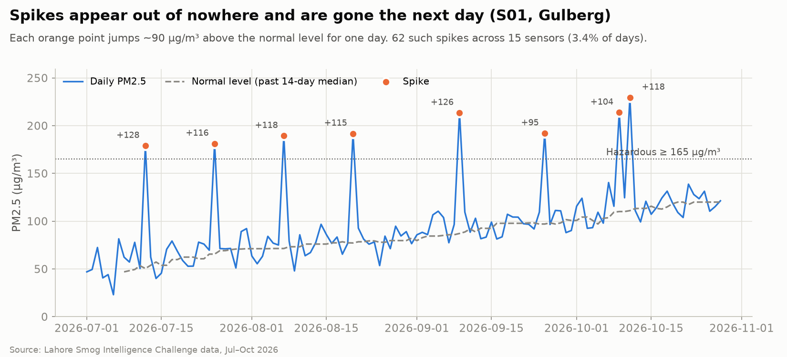
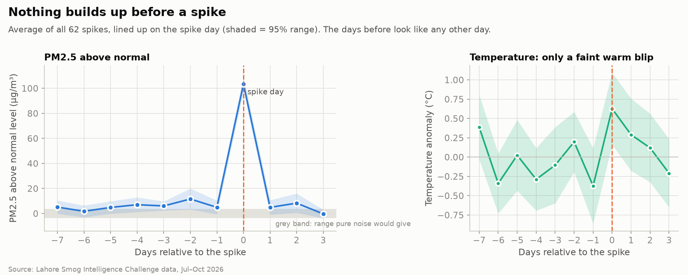
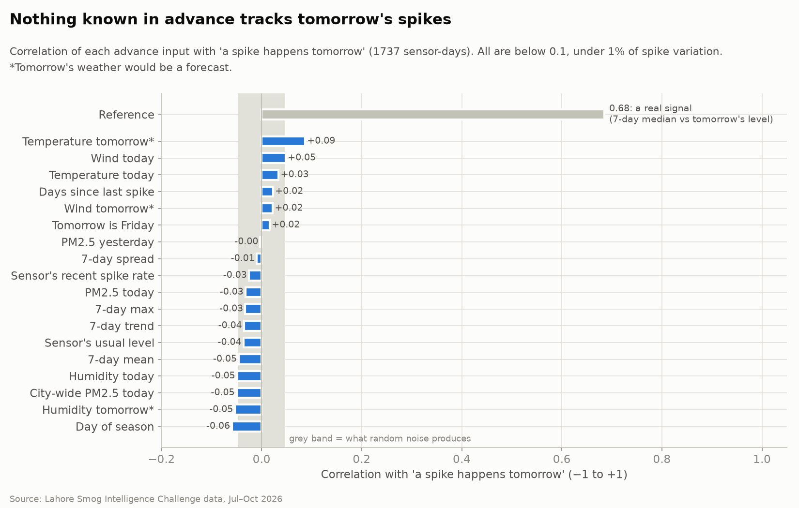
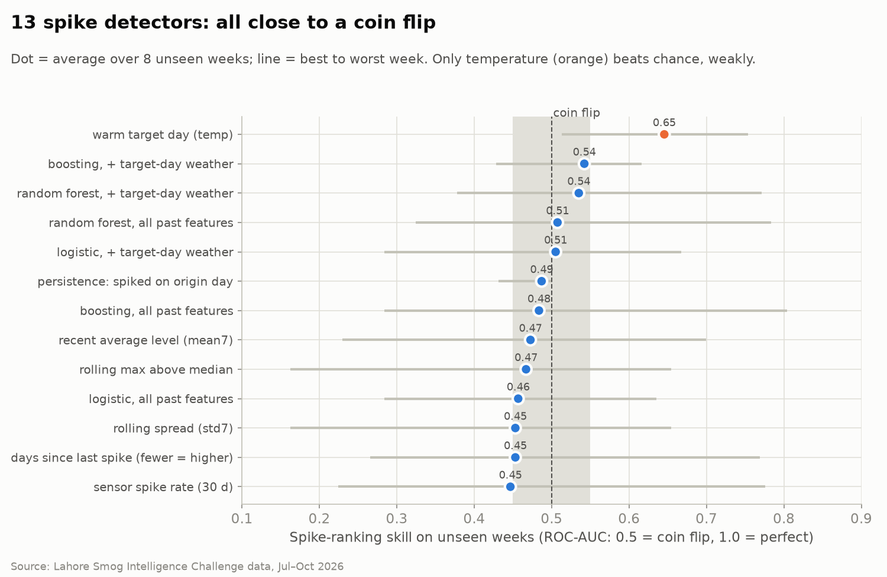
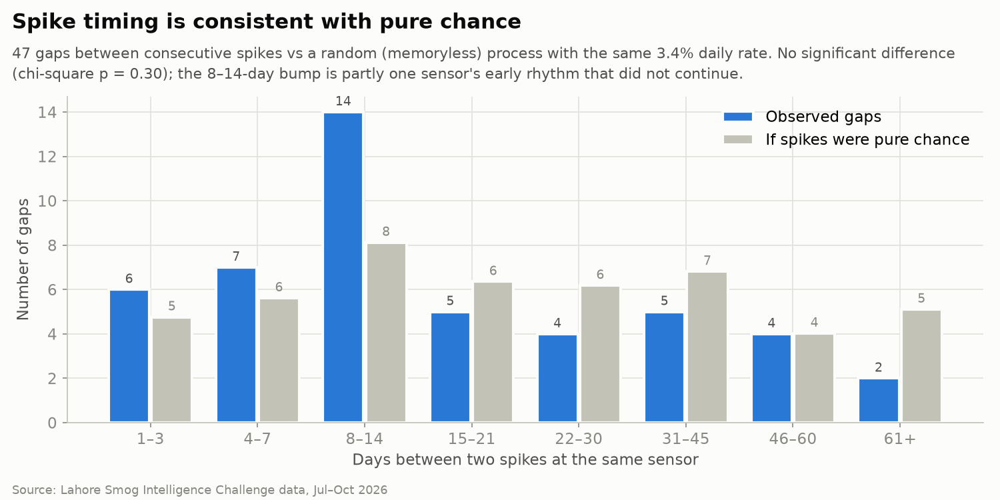
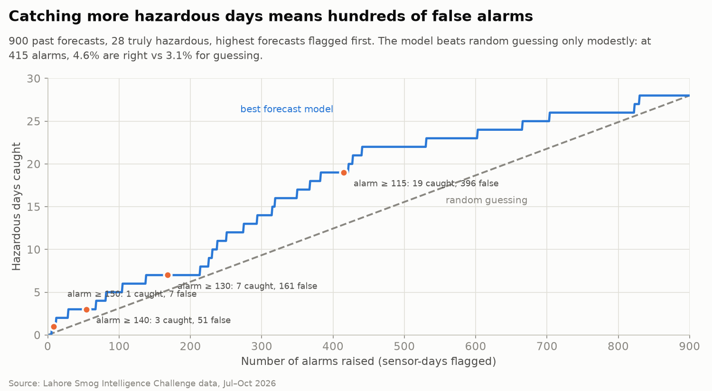

# Predicting the 5%: How to Forecast Rare Spikes, and How to Know When You Can't

Oct 10, 2026 · @Saad Nazir

Two hackathons, OneAI 2025 by Speridian technologies and LOOPVERSE 3.0 by Looplab (where I finished runner-up), gave me what looked like two unrelated problems. They turned out to be the same one.

One was air quality forecasting for 15 sensors in Lahore. Readings followed a steady level about 97% of the time, and the other 3% were sudden spikes that pushed the air into the hazardous range. The other was inventory. A manufacturer buys an expensive raw material. Storing it costs money, running out costs money, and demand sometimes jumps without notice.

In both cases the ordinary days are easy and the rare days carry most of the cost. This post explains why standard forecasting models fail on those rare days, how to check whether your spikes can be predicted at all, and two methods that work when they can, with code. It also shows what happened when I ran all of it on the real hackathon data: the honest answer there was that the spikes gave no warning.

It assumes no machine learning background, and every term is defined where it first appears.

## The problem: forecasting Lahore's smog

The LOOPVERSE 3.0 challenge asked for a forecast of tomorrow's air quality for 15 areas of Lahore, plus a yes-or-no warning for hazardous days. Each team had four hours and one submission.

The pollutant was **PM2.5**: airborne particles smaller than 2.5 micrometres, measured in micrograms per cubic metre (µg/m³). The challenge defined a day as **hazardous** when PM2.5 reached 165 µg/m³ or more. That line mattered in practice: the supplied city rules switched schools to half days and suspended outdoor sports at 165, and advised vulnerable people to stay indoors.

What we were given:

- **120 days of daily readings** (July to October 2026) from 15 sensors.
- **Two sensor networks that disagreed on everything.** One reported PM2.5 in UTC time; the other reported the Air Quality Index (AQI), a different scale, in Pakistan time. Merging them without converting units and shifting the clock put readings on the wrong day.
- **Deliberately broken data:** -999 for missing readings, and one sensor stuck at the same value for three days.
- **Daily weather:** temperature, humidity and wind.
- **The task:** predict PM2.5 and the hazardous flag for each sensor for the next 10 days, 150 predictions in all, scored against hidden true values the organisers held back.

The handbook warned about four traps: using future data, mismatched networks, broken values and misleading accuracy. The last one is this post's subject. Over the 120 days, about 3% of sensor-days were hazardous, so a model that always answered "not hazardous" was right 97% of the time and useless.

Cleaning the data and forecasting the normal level turned out to be the manageable part. The hard part was the hazardous flag: almost every hazardous day was a sudden one-day spike far above that sensor's normal level, and the warning had to catch those.

## Why ordinary models miss spikes

A standard model misses spikes because it is rewarded for being right on average, and the average day is not a spike day.

A running example helps. You own a chai stall. On 95 days out of 100 you sell about 100 cups. On the other 5 days, a cricket match or sudden rain pushes sales to 400. You hire a helper to guess tomorrow's sales so you can buy the right amount of milk.

- The **helper** is the model: something that learns from past data and produces a prediction.
- **Training** is the helper reading your old sales diary and looking for patterns.
- The **loss** is the fine you charge for each wrong guess. The helper adjusts his guessing to be fined less.
- **Mean squared error (MSE)** is the most common fine rule: the fine is the size of the mistake, squared. Off by 10 cups costs 100. Off by 300 costs 90,000.

Now suppose the helper cannot tell which days will be busy. The single guess that gives the lowest total fine under MSE is the average:

$$0.95 \times 100 + 0.05 \times 400 = 115 \text{ cups}$$

So he says 115 every day. He is slightly wrong on normal days, badly wrong on busy days, and he never predicts a spike. He is doing exactly what the fine rule asks.

The hackathon data behaved exactly like the chai stall. A sensor sat at its normal level, jumped about 90 to 130 µg/m³ for a single day, then fell straight back. My best model forecast the normal level well, 16% more accurately than a 7-day average, but its highest forecast for the test period was 163.9 µg/m³. The hazardous line was 165, so it never raised an alarm.



Every fix in this post changes one of three things: what the helper is asked, what he is allowed to look at, or how he is fined. But first, a check that most guides skip.

## Before you model: the spike pre-flight check

A spike model needs warning signs in the data, so check for them before building one. These six checks take about an hour. On the LOOPVERSE data (15 sensors, 120 days) they changed what I built.

**Check 1: Are the spikes real?** Bad data looks like spikes. Our sensors used -999 for "no reading", one sensor was stuck at the same value for three days, and half the network reported a different unit (AQI, not PM2.5) in a different timezone. Uncleaned, those errors would have created fake spikes or hidden real ones. Check sentinel values, flat lines, units and timezones first.

**Check 2: Are there enough spikes to learn from?** Count them. We had 62. That is enough to look for patterns, but too few to train a large model: a classifier with 30 features memorised noise. With fewer than a few hundred spikes, keep models small or use Method B.

**Check 3: Does anything build up before a spike?** Line up every spike on day 0 and average the days around it. If the line rises before day 0, there is a warning sign. Ours was flat: the days before a spike looked like any other day.



**Check 4: Does anything you will know in advance correlate with the spike label?** Compute the correlation of each feature with "spike tomorrow" and compare it with the band random noise produces, roughly ±2/√n for n rows. Ours were all below 0.1. The same features correlated 0.68 with tomorrow's normal level, so they carried information about the level but none about spikes.



**Check 5: Does a simple model beat a coin flip on data it has not seen?** Train a small classifier with walk-forward validation (Step 3) and look at ROC-AUC per fold. ROC-AUC measures how well a model ranks spike days above normal days: 0.5 is a coin flip, 1.0 is perfect. Our 13 detectors, covering every simple model in the hackathon handbook, scored 0.45 to 0.54 on past data. Only "tomorrow is warm" reached 0.65.



**Check 6: Does spike timing look random?** Compare the gaps between spikes with what a random process at the same daily rate would produce. Ours were consistent with chance (chi-square p = 0.30), so there was no schedule to learn.



**Reading the result.** If checks 3 to 5 show a signal, use Method A. If they do not, no model will time your spikes, and that is a finding rather than a failure. Use Method B to size a safety margin, add fast detection so you react within hours, and look for the missing data source. For air quality that could be fire reports, traffic or hourly readings. For inventory it could be promotions or customers' order calendars.

## Step 1: Define a spike as a number

A spike needs an exact definition before a model can learn it. A simple one: any value above the 95th percentile of your training data.

The percentile is a ranking. Line up 100 days from lowest sales to highest. The day standing at position 95 is the 95th percentile, and only 5 days are above it.

Mark those days in the diary with a red sticker. The sticker is the **label**: 1 for spike, 0 for normal. A label is the answer you want the model to learn to produce.

Pick the cutoff to match the problem:

- **A fixed percentile** works when the normal level is stable.
- **An official limit** suits health data. The hackathon used 165 µg/m³, the hazardous line.
- **A distance above a rolling baseline** is needed when the level trends. In our data PM2.5 rose from about 73 in July to 120 in October, so a percentile from July data would have called ordinary October days spikes. We defined a spike as more than 45 µg/m³ above the sensor's median of the previous 14 days.
- **A stock level** fits demand: the point at which your usual stock runs out.

## Step 2: Give the model warning signs

A spike can only be predicted if something in the data changes before it happens. Rain has clouds before it. Your job is to find the clouds.

**Features** are the clues the model looks at before it guesses. These are the ones that matter most for spikes:

| Feature | Plain meaning | Chai stall version |
| --- | --- | --- |
| Lag | The value some steps ago | Yesterday's sales, and the same day last week |
| Rolling mean | The average of the last N steps | How the past week went overall |
| Rolling standard deviation | How much recent values jumped around | Whether sales have been steady or erratic |
| Difference | The last value minus the one before | Whether sales are climbing |
| Calendar | Hour, weekday, month | Fridays and winter evenings are busier |
| Outside causes | Things that drive the value | Match schedule, weather forecast |

For air quality, the outside causes are wind speed, humidity, temperature and readings from nearby stations. For demand, they are promotions, holidays and large customers' order cycles. Calendar features earned their place in our data: adding the weekday cut the level forecast's error by about 10%, because Fridays ran 7 µg/m³ above normal and Mondays 8 below.

One rule is strict: every feature must come from before the moment you are predicting. Breaking it is called **leakage**. It is the helper peeking at tomorrow's page of the diary. He looks brilliant in practice and fails on a real day.

The subtle case is outside causes. Use only what you would truly have at prediction time: tomorrow's *weather forecast* is fair, tomorrow's *actual weather* is leakage. In our data, actual target-day weather also made the boosted-tree models worse (XGBoost error rose from 14.7 to 15.9 µg/m³), because they fitted noise in it. A good test: replace every value after the prediction time with random numbers and check that no feature changes.

```python
import pandas as pd
import numpy as np
import lightgbm as lgb

df = pd.read_csv("data.csv", parse_dates=["time"])
df = df.sort_values("time")

# y is the column we want to predict
for k in [1, 2, 3, 6, 12, 24]:
    df[f"lag_{k}"] = df["y"].shift(k)

past = df["y"].shift(1)
df["mean_24"] = past.rolling(24).mean()
df["std_24"] = past.rolling(24).std()
df["diff_1"] = past - df["y"].shift(2)
df["hour"] = df["time"].dt.hour
df["dow"] = df["time"].dt.dayofweek
df = df.dropna()
```

`shift(1)` means "the previous row". It is what keeps future information out. To predict H steps ahead instead of one, shift every feature by at least H.

## Step 3: Split by time, never at random

Train on the older part of the data and test on the newest part. This is a **time split**, and it is the only honest test for a forecasting model.

Let the helper study January to August, then quiz him on September and October. If you shuffle the pages instead, he studies pages from October and is tested on September. That is practising with the exam paper already in hand.

```python
cut = int(len(df) * 0.8)

# threshold from training data only
thr = df["y"].iloc[:cut].quantile(0.95)
df["spike"] = (df["y"] > thr).astype(int)

train, test = df.iloc[:cut], df.iloc[cut:]
X = [c for c in df.columns
     if c not in ("time", "y", "spike")]
```

The spike threshold is computed from the training rows alone. Computing it from all the data would be a small leak of its own.

**When spikes are rare, one split is not enough.** A single test period may hold only a handful of spikes, so its score is mostly luck. Use **walk-forward validation** instead: train up to week 1 and test the next week, then train up to week 2 and test the week after, and so on. Report the average and the range across folds.

On our data one test week held only 4 spikes, and the same model scored 0.16 ROC-AUC on one week and 0.80 on another. A single split could have shown either number.

```python
folds = []
for start in range(cut, len(df) - 7, 7):  # 7 rows = one week of daily data (use 168 for hourly)
    tr, te = df.iloc[:start], df.iloc[start:start + 7]
    folds.append((tr, te))
```

## Step 4: Choose the model

For data that fits in a table, gradient boosted trees are a strong default, and LightGBM is a fast library that builds them.

- A **decision tree** is a game of twenty questions. "Match today? Yes. Raining? No. Then about 350 cups."
- **Gradient boosting** is a team of such trees. The first one guesses. The second studies only the first one's mistakes. The third studies what is still wrong, and so on for hundreds of rounds.

On tabular data this approach usually matches or beats neural networks, trains in seconds and needs little tuning. That makes it a sensible first choice under hackathon time limits.

**Always compare it against two simpler models.** A naive baseline ("tomorrow equals the average of the last 7 days") tells you whether the model learned anything. A **regularised linear model** such as ridge regression, a straight-line model with a penalty that stops any one feature dominating, often wins on short histories. On our 120 days, ridge beat tuned XGBoost (12.7 vs 13.1 µg/m³ error on unseen weeks) and an LSTM neural network (14.4). With little data, trees chase noise.

## Method A: Ask two questions instead of one

Split the job in two: first decide whether a spike is coming, then estimate how large the value will be. Statisticians call this a **hurdle model**.

- A **classifier** predicts a category. Think of a watchman who only answers yes or no: "busy day tomorrow?"
- A **regressor** predicts a number. Think of an estimator who answers "how many cups?"

You keep one estimator trained on normal days and one trained on busy days. The watchman decides which one to listen to.

The watchman has a problem called **class imbalance**. Only 5% of days are busy, so he can say "not busy" every day and be right 95% of the time while being useless. **Class weights** fix this. You fine him about 20 times more for missing a busy day than for a false alarm, and he starts paying attention.

```python
clf = lgb.LGBMClassifier(
    n_estimators=400,
    learning_rate=0.05,
    class_weight="balanced")
clf.fit(train[X], train["spike"])
p = clf.predict_proba(test[X])[:, 1]

norm = train[train.spike == 0]
spk = train[train.spike == 1]
m_norm = lgb.LGBMRegressor().fit(norm[X], norm["y"])
m_spk = lgb.LGBMRegressor().fit(spk[X], spk["y"])

t = 0.5  # a starting point only: tune it (below)
pred = np.where(p > t,
                m_spk.predict(test[X]),
                m_norm.predict(test[X]))
```

`p` is a spike score between 0 and 1 for each row. The threshold `t` is how sure the watchman must be before he raises the alarm. It works like the sensitivity of a smoke detector: too sensitive and it goes off for toast, too dull and it sleeps through a fire.

Tune `t` on a **validation slice**, meaning the last part of the training data held back for this purpose. Do not tune it on the test set, or the test stops being a fair exam.

Four lessons from running this on the hackathon data:

1. **Class weights distort the score.** Weighting made our watchman's average score 0.35 when the true spike rate was 0.03, so `t = 0.5` meant nothing. Treat `p` as a ranking, tune `t`, and **calibrate** it (Platt scaling or isotonic regression on later data) before reading it as a probability.
2. **Keep the classifier small.** With 62 spikes, a classifier on 30+ features scored 0.39 to 0.50 ROC-AUC, no better than a coin flip. The same classifier on 3 features (temperature, temperature change, recent level) scored 0.63. Add a feature only if it helps on later, unseen weeks.
3. **The spike size can be simpler than the spike timing.** A constant "typical spike size" (the median of past spikes, about +90) predicted spike heights better than a ridge model did (error 24.1 vs 26.5). With fewer than a few hundred spike examples, the spike regressor is unreliable.
4. **Mixing the two answers by probability never raises an alarm.** "Normal level + p × spike size" with a calibrated p of 0.03 adds only about 3 µg/m³. An alarm needs the hard yes-or-no decision above.

If you have few spike examples, Method B is the safer choice.

## Method B: Predict the high end, not the middle

Instead of asking "how many cups will I sell?", ask "what number will I stay under on 9 days out of 10?" That number is the **0.9 quantile**. A quantile is the same idea as a percentile, written as a fraction.

Training a model to answer this is called **quantile regression**. It uses a different fine rule, the **pinball loss**. At the 0.9 quantile, guessing too low costs 9 times more than guessing too high by the same amount. The helper learns to lean high whenever the clues look risky.

```python
q50 = lgb.LGBMRegressor(
    objective="quantile", alpha=0.5)
q90 = lgb.LGBMRegressor(
    objective="quantile", alpha=0.9)

q50.fit(train[X], train["y"])
q90.fit(train[X], train["y"])

typical = q50.predict(test[X])
high = q90.predict(test[X])
```

The gap between the two predictions is a risk signal, **if the clues carry warning signs**. "Typical 100, high 110" is a calm day. "Typical 100, high 380" means the conditions that came before past spikes are present again. When the clues carry none, the gap is simply wide on every day. On our data the gap carried no spike information: as a spike score it reached ROC-AUC 0.45 to 0.47, no better than a coin flip. The median forecast matched ridge almost exactly (13.1 vs 12.9 µg/m³ error), and the true value stayed under the 0.9 quantile on 85% of days, a little short of the 90% target because pollution kept rising through the season. Raising an alarm whenever the high end reached 165 caught 1 of 32 hazardous days for 26 false alarms.

Method B needs no spike label and no second model, and it uses every row of data. Its limit is that it gives a safe upper level, not a yes-or-no alarm. That upper level is still useful when timing cannot be predicted: it tells you how much margin to keep. If you need an alarm, use Method A or raise one when the gap crosses a chosen size.

## Step 5: Grade the model on the spikes

Overall error hides the problem, because the 95 normal days dominate the average. Measure the spike days separately.

- **Recall:** of the real spikes, what share did the model warn about?
- **Precision:** of the warnings it gave, what share were real?
- **Mean absolute error on spike rows:** on the days that mattered, how far off was the predicted value?
- **PR-AUC against the base rate:** how well the scores rank spikes, where pure guessing scores the spike rate itself (0.031 in our data).
- **ROC-AUC against 0.5:** the same question on a scale where a coin flip scores 0.5.
- **The range across folds:** the worst and best week, not only the average.

Do not rely on **accuracy**, the share of days classified correctly. When spikes are rare it rewards silence: on our data, "never raise an alarm" scored 97.3% accuracy and caught none of the 32 hazardous days. Our spike model scored a "worse" 85.4% and caught 9.

```python
from sklearn.metrics import (
    recall_score, precision_score,
    mean_absolute_error, average_precision_score)

alarm = (p > t).astype(int)
print(recall_score(test.spike, alarm))
print(precision_score(test.spike, alarm))
print(average_precision_score(test.spike, p), "vs base", test.spike.mean())

m = test.spike == 1
print(mean_absolute_error(test.y[m], pred[m]))
```

Recall and precision pull against each other. Lowering the threshold catches more spikes and raises more false alarms. Which one matters more depends on the cost of each mistake: a missed pollution warning is usually worse than an unnecessary one.

One more comparison makes the trade-off honest: plot the spikes caught against the number of alarms raised, next to the line random guessing would draw. If your model's line hugs the guessing line, extra alarms are buying almost nothing.



## Case study: what happened on the LOOPVERSE data

The most accurate forecast was the one that never predicted a spike, so that is the one I submitted. Every row below was scored on weeks the model had not seen (walk-forward validation, 1,200 sensor-days, 32 truly hazardous):

| Approach | Hazardous days caught (of 32) | False alarms | Typical error (µg/m³) |
| --- | --- | --- | --- |
| 7-day average (baseline) | 0 | 0 | 15.7 |
| Ridge level forecast (submitted) | 0 | 0 | 12.9 |
| Method A, 30+ features, class weights | 5 | 119 | 21.3 |
| Method A, 3 features, class weights | 9 | 152 | 23.5 |
| Method B, alarm when the 0.9 quantile reaches 165 | 1 | 26 | 13.1 (median forecast) |
| Method B, alarm threshold lowered for best F1 | 14 | 283 | not measured (alarm only) |

The level forecast behaved like the chai-stall helper: accurate on ordinary days, silent on spikes. Method A caught 9 of 32 hazardous days, but 19 of every 20 alarms were false and the typical error nearly doubled, because every false spike adds about 90 µg/m³ of error to that row.

For the final test period the spike model flagged nothing at all. Its only signal was "warm days spike slightly more often", and the early-November test days were cool (17 to 22 °C).

I submitted the level forecast with the official 165 µg/m³ alarm rule and reported the 0% spike recall openly, along with the pre-flight evidence. "These spikes give no warning in this data" was the honest result, and the checks above are what proved it.

## From forecast to decision: the inventory problem

For inventory you do not need to know the exact day of a spike. You need to know how much to hold, and the two costs tell you which quantile to stock to.

Running out of milk loses customers. Extra milk goes bad. The stock level that minimises total expected cost is the demand quantile at:

$$q = \frac{\text{stockout cost per unit}}{\text{stockout cost per unit} + \text{holding cost per unit}}$$

If running out costs 9 per unit and storing costs 1, then q is 9 / (9 + 1) = 0.9. Train the Method B model with `alpha=0.9` and order what it predicts. If storage were as expensive as a stockout, q would be 0.5 and you would stock to the typical day.

This is the classic **newsvendor rule** from operations research. It covers one ordering period and ignores supplier lead time, so treat it as the starting point for a real system. Its value is that it turns a forecast into a decision measured in money.

It is also the right tool when the pre-flight check finds no warning signs. You cannot time an unpredictable spike, but you can hold enough margin that it costs less when it arrives.

## What cannot be predicted

If nothing in your data changes before a spike, no model can predict when it will happen. Rain has clouds before it. An earthquake does not.

Be precise about what that means. "The spikes in this data give no advance warning" is a finding you can prove with the pre-flight check. "Spikes are impossible to predict" is not: the warning may exist in data you do not have yet. For the Lahore sensors that could be crop-burning reports, traffic counts, satellite smoke data or hourly readings.

When no warning sign exists, three things still help:

1. **A margin.** Method B and the newsvendor rule size how much buffer to hold.
2. **Fast detection.** An alert when readings or sales run far above normal lets you react within hours instead of days.
3. **A search for the missing signal.** Every new data source is worth running through the pre-flight check again.

## Checklist

1. Clean the data first: sentinel values, stuck sensors, units and timezones.
2. Define a spike with a number, relative to a rolling baseline if the level trends, and label every row.
3. Count your spikes. Fewer than a few hundred means small models or Method B.
4. Run the pre-flight check: the before-and-after average, correlations against the noise band, a coin-flip test on unseen folds and a timing test.
5. Build lag, rolling, difference, calendar and outside-cause features from information available at prediction time only.
6. Split by time with walk-forward folds, and compute the spike threshold from the training part.
7. Compare every model against a naive baseline and a regularised linear model.
8. If the pre-flight check found signal, train Method A with a small classifier, tune the alarm threshold on a validation slice and calibrate the score. Otherwise, or with few spikes, use Method B.
9. Report recall, precision, error on spike rows, PR-AUC against the base rate and the range across folds, and compare with random guessing at the same number of alarms. Never rely on accuracy.
10. If the goal is a decision such as stock level, pick the quantile from the two costs.

The short version: a model predicts what its loss rewards, and it can only learn what its data contains. Reward the average and you get the average. To get the rare days right, change the question, the clues or the fine, but first check that the clues exist.
