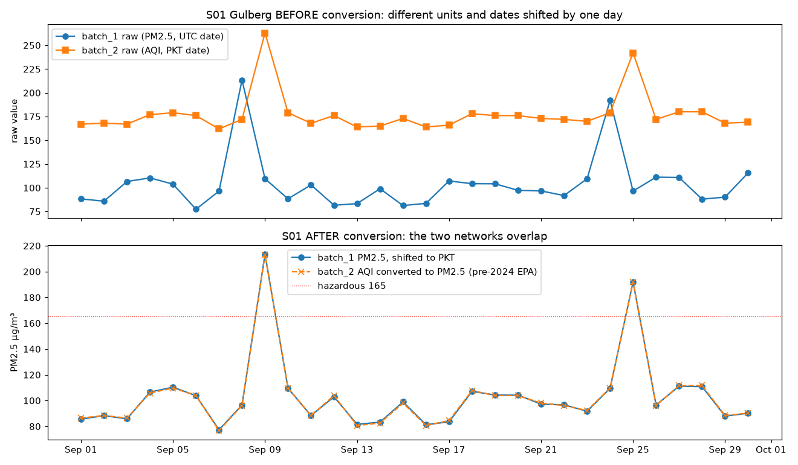
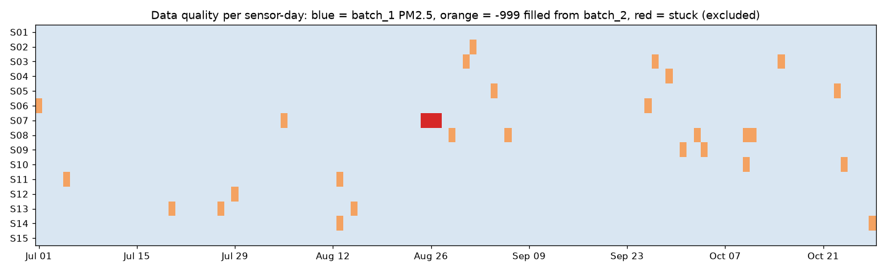
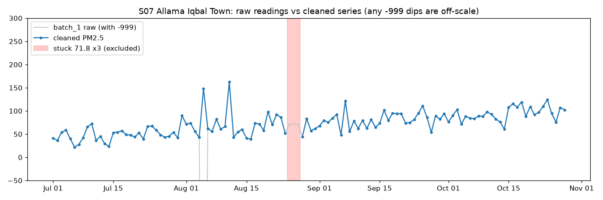
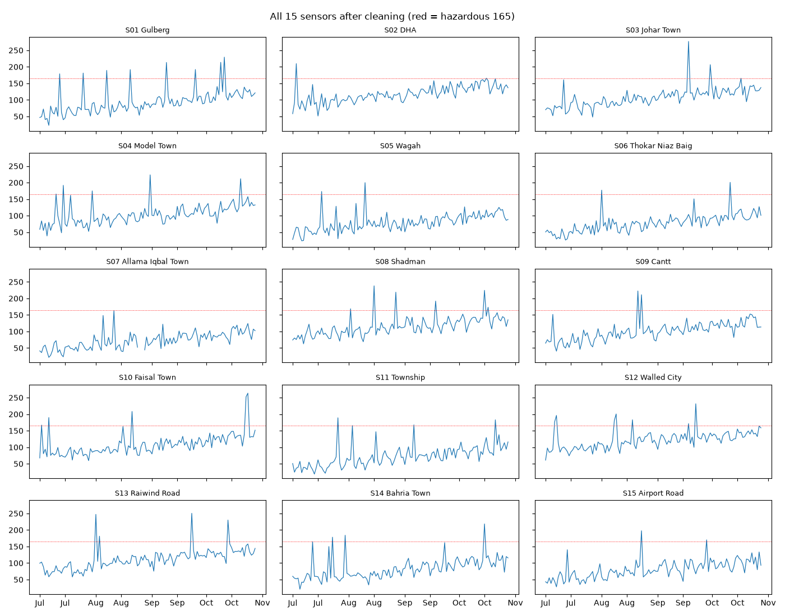

# Trap audit

Generated by `python src/audit_traps.py`. Each section answers one row of the handbook's trap table.

## Trap 1: Future leakage

**Handbook check:** print train and validation date ranges and feature timestamps; use chronological or walk-forward validation.

| Fold origin | Train target dates | Train rows | Validation target dates | Val rows | Gap OK |
|---|---|---|---|---|---|
| 2026-09-13 | 2026-07-02 .. 2026-09-13 | 10395 | 2026-09-14 .. 2026-09-23 | 150 | yes |
| 2026-09-20 | 2026-07-02 .. 2026-09-20 | 11445 | 2026-09-21 .. 2026-09-30 | 150 | yes |
| 2026-09-27 | 2026-07-02 .. 2026-09-27 | 12495 | 2026-09-28 .. 2026-10-07 | 150 | yes |
| 2026-10-04 | 2026-07-02 .. 2026-10-04 | 13545 | 2026-10-05 .. 2026-10-14 | 150 | yes |
| 2026-10-11 | 2026-07-02 .. 2026-10-11 | 14595 | 2026-10-12 .. 2026-10-21 | 150 | yes |
| 2026-10-18 | 2026-07-02 .. 2026-10-18 | 15645 | 2026-10-19 .. 2026-10-28 | 150 | yes |

**Feature timestamps:** the latest data each feature reads, relative to origin day t (0 = the origin day itself, never later):

| Feature | Reads |
|---|---|
| `lag0` | t |
| `lag1` | t-1 |
| `lag2` | t-2 |
| `lag3` | t-3 |
| `lag4` | t-4 |
| `lag5` | t-5 |
| `lag6` | t-6 |
| `mean3` | t-2..t |
| `mean7` | t-6..t |
| `mean14` | t-13..t |
| `std7` | t-6..t |
| `max7` | t-6..t |
| `min7` | t-6..t |
| `trend7` | t-13..t |
| `sensor_level` | start..t |
| `sensor_offset` | start..t |
| `city_lag0` | t (all sensors) |
| `city_mean7` | t-6..t (all sensors) |
| `h` | horizon (constant) |
| `w0_temp_c` | t |
| `w0_humidity_pct` | t |
| `w0_wind_kmh` | t |
| `dow0` | calendar of target date (known in advance) |
| `dow1` | calendar of target date (known in advance) |
| `dow2` | calendar of target date (known in advance) |
| `dow3` | calendar of target date (known in advance) |
| `dow4` | calendar of target date (known in advance) |
| `dow5` | calendar of target date (known in advance) |
| `dow6` | calendar of target date (known in advance) |
| `spike_rate30` | t-43..t |

Spot check: sensor S01, origin 2026-10-28: lag0 = 121.3 = reading dated 2026-10-28 (121.3). The target is 2026-10-29 (h=1).
Automated proof: `python tests/test_leakage.py` randomises all data after each origin and checks that every feature is identical.

## Trap 2: Networks mismatch

**Handbook check:** use the supplied conversions before aggregation; plot two same-area sensors after conversion.

Each area is measured by both networks (batch_1: UTC, PM2.5; batch_2: PKT, AQI), so the same-area comparison is batch_1 vs batch_2 for one sensor.

| Check | Result |
|---|---|
| Median abs. difference, batch_1 vs converted batch_2, correct PKT alignment (all sensors) | **0.41 µg/m³** |
| Same, if UTC dates are used without the +5 h shift | 13.4 µg/m³ (wrong day matched) |
| Correlation of the two networks after conversion (S01) | 0.9999 |
| AQI table | pre-2024 US EPA (1714/1744 exact; 2024 table: 171/1744) |

## Trap 3: Broken values

**Handbook check:** replace the sentinel before calculations, plot sensors, and flag, exclude or impute the faulty interval consistently.

| Check | Result |
|---|---|
| -999 in batch_1 / batch_2 | 27 / 29 |
| batch_1 mean if -999 were left in | 79.8 µg/m³ (vs 96.3 correct) |
| -999 left after cleaning | 0 |
| Gaps recovered from the other network | 27 |
| Stuck interval | S07 2026-08-25..2026-08-27, value 71.8 in batch_1 and AQI 159 in batch_2 |
| Handling | Excluded as training targets; features forward-fill from the last good day (max 3 days); same rule in every fold and in the final model |

## Trap 4: Misleading accuracy

**Handbook check:** evaluate hazardous recall plus precision and false alarms, not overall accuracy alone.

Submitted model: **ridge_strong**, alarm when predicted >= **165**. Validation = all 6 walk-forward folds (900 rows, 28 hazardous).

| Alarm when predicted ≥ | Accuracy | Recall | Precision | Caught | False alarms | Missed |
|---|---|---|---|---|---|---|
| 165 **(submitted)** | 96.9% | 0.00 | nan | 0 | 0 | 28 |
| 150 | 96.2% | 0.04 | 0.12 | 1 | 7 | 27 |
| 145 | 95.0% | 0.07 | 0.10 | 2 | 19 | 26 |
| 140 | 91.6% | 0.11 | 0.06 | 3 | 51 | 25 |
| *never alarm* | 96.9% | 0.00 | n/a | 0 | 0 | 28 |

Accuracy is ~97% for every row, including "never alarm". It cannot tell the options apart, which is the trap. Recall, precision and false alarms can.

Holdout: 0 of 150 rows flagged hazardous; forecasts 102.7..163.9 µg/m³.
Trade-off and decision: SPRINT1.md section 6.
